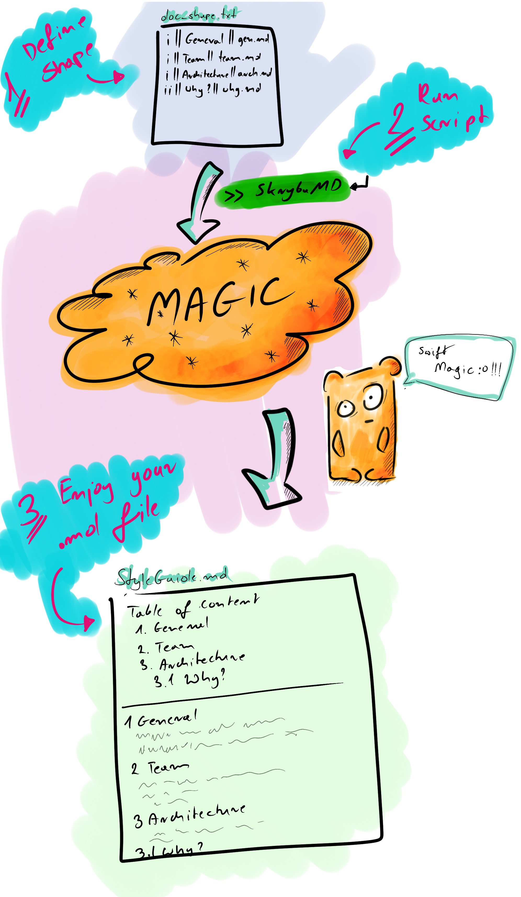
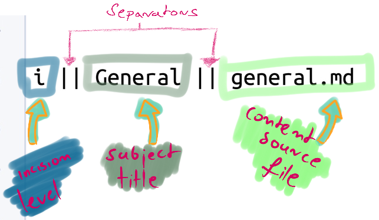

[](/LICENSE)
[](https://developer.apple.com/swift)
[](https://twitter.com/Roherdzik)

# SkrybaMD 📝
Simple markdown documentation generator, never again -> git conflicts among the team members which are updating documentation at the same time 💥

# Motivation to create SkrybaMD

We all know that in big teams we have a lot of agreements which needs to be stored somewhere (for newcomers and also for current developers), this script will help you to do this, create your SwiftStyleGuide.md or ArchitectureDescription.md documentation in easy to maintain way 🚀

Therefore, creating of documentation for your project, should not limit you at all! Maintaining and editing documentation needs to be easy as it is possible, also we should minimalise situation when multiple team members are manually editing main documentation file, it leads us only towards problems (git conflicts), and in result slow us down 🛩.
This simple to use script is intended to be very easy to use and reduce as much as possible git conflicts among the team members interaction with documentation.
- By separate file for each Table of Content subject we can organize information in small encapsulated .md files.
- There will be no longer situation that someone won't add another subject in the middle of the documentation, because all subjects iteration is done by the script.
- You can define as many intentions in the file as you want!
- You can tap into Table of Content subject and you will be redirected to particular place in the documentation file.

# How it works? 



## Features
- automatic subject enumeration
- separation of content by using different source .md file for each Section. In this way there will be very small probability to have merge conflicts in the team
- multiple intent, you can define easily structure which will support e.g. 1.1.1.3 subject intent

# Usage

1. **Define shape of your documentation**

To do so, you need to create your own `doc_shape.txt` (see and play with Example folder).

Follow convention explained below:


_`doc_shape.txt` example:_

```
i || General || general.md
i || Architecture || architecture_config.md
ii || Our Approach || our_approach.md
i || CI and Rest || ci_and_rest.md
i || Summary || summary.md
```

2. **Create files content for each subject**

Create source .md file for each Subject in the same directory as `doc_shape.txt`.
In the shape example which we see above, it will be e.g. file with the `general.md` name for "General" subject. Base on mentioned `general.md` file, script will create documentation body.

3. **Run Script**

Run script using terminal in the directory of previously defined files (`doc_shape.txt` and content subjects .md files). 

`$ SkrybaMD MySuperDocumentation`  - if you have installed SkrybaMD globally 🌍

or

`$ ./SkrybaMD MySuperDocumentation` - if you have SkrybaMD script in the current directory 🏠

You will find markdown generated `MySuperDocumentation.md` file in the same directory 💥

ENJOY 🙌

_NOTE: you can play around with script using "Example" folder from this repository_

**Check help**

If you are not sure how to use it, go and hit `--help` to get verbose instructions

`$ SkrybaMD --help`

# Installation

Using Swift Package Manager
```
$ git clone https://github.com/robertherdzik/SkrybaMD.git
$ cd SkrybaMD
$ swift build -c release
$ cp -f .build/release/SkrybaMD /usr/local/bin/SkrybaMD
```

# Contribution

If you have any idea how to improve the project, feel free to do it 🙌❤️
